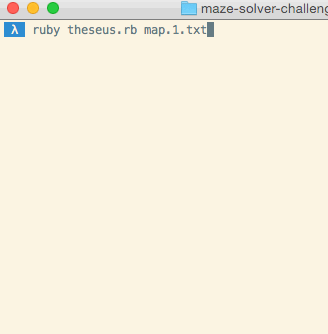

# Theseus.rb

In this challenge you will use your knowledge of data structures and algorithms to build a maze solver.

*Note: In this challenge you are not required to implement your own data structures.*

## Release 1, Reading the Maze

Your maze will be defined in a text file that looks like this:

```
o#........
.#####.##.
.......##.
######.#*.
.......###
```

 * `#` is a wall
 * `.` is an open tile
 * `o` is your start point
 * `*` is your goal

You will need to read in the Maze file and model it in your program. The maze can be any dimension and in any configuration, but it will always have four sides, and corridors will always be 1 block wide (as shown above).

There's a saying, "90% of programming is choosing the right data structures." Pick something simple and flexible to start. You may refactor it as you develop your solver algorithm.

## Release 2, The Solver

Your task is to write an algorithm that walks the maze and determines if it is solvable or not. Your program can simply print out "Solvable" or "Unsolvable".

### Thinking it Through

 * How would _you_ solve it with pen and paper?
 * Can a computer do it the way you did?
 * If not, why? What kind of approach(es) might work for a computer?
 * Can you break them down to a pseudocode algorithm?
 * When you consider your possible solution, what data structures would help you model the problem or manage state in your algorithm?

### Design considerations

We'll be experimenting with different approaches in the coming releases, so think about how you will handle swapping different algorithms that direct your search. Your code should have an interface that lets you "drop in" a given strategy.

## Release 3, Show and Tell

Visualize the search pattern of your algorithm by clearing the terminal screen and reprinting the map at each stage of the exploration. Mark the explored areas as it progresses.

You can use this to clear the screen between print statements:

```ruby
def clear_screen
  print "\e[2J\e[f"
end
```

What does your algorithm's search pattern look like? Commit a description in `notes.md`.


## Release 4, Strategery
Develop two algorithms. One should look something like this:


And the other should look like this:



**Note**: The two approaches above are identical except for the data structure they use under the hood.

Release 3 should have made it easy to swap in approaches. In fact, you may have inadvertently implemented some form of the [strategy pattern](http://en.wikipedia.org/wiki/Strategy_pattern).

## Release 5, On the Shoulders of Giants

The two strategies above are essentially the same, save for the data structure they use to keep track of unexplored tiles.

The first strategy is known as a [depth-first search](http://en.wikipedia.org/wiki/Depth-first_search). It uses a **Stack**.

The second strategy is known as a [breadth-first-search](http://en.wikipedia.org/wiki/Breadth-first_search). It uses a **Queue**.

DFS and BFS are classic algorithms in computer-science. Specifically, they're graph-search algorithms, and that's no accident. Your maze is just an [undirected graph](http://en.wikipedia.org/wiki/Graph_theory) of tiles. Each tile in the map is a _node_, with _edges_ pointing to neighboring cells.

In all likelihood, you derived something that looks close to DFS and BFS yourself. This demonstrates the power of having strong computer science fundamentals. While the problems we solve vary on the surface, many problems are just instances of a generalizable problem with known  solutions. DFS was invented in the 19th century, BFS in the 1950s. Those who cannot learn from history are doomed to reimplement it.

If you aren't already using stacks and queues in your strategies, refactor your code now. Both should use an iterative, not recursive, approach. In the truth, the code will be identical save the data structure but keep them separate for now instead of trying to DRY it up.
